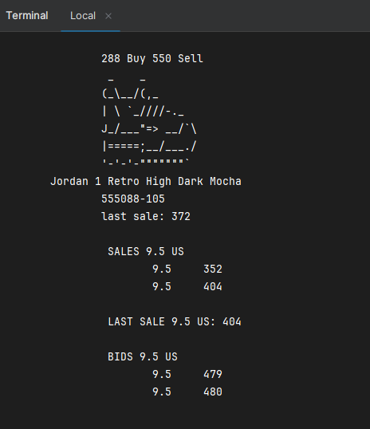

Based on [dfleta's StockX kata](https://github.com/dfleta/stockx-ascii), programmed during the 1st year of Cross-platform App Developement. 

This program mimics the search function of the auctioning page StockX, being able to apply up to two different criterias that filter classes under the *Item* interface, and then print the results of the filtration directly on the console. This is handled by the Java **stream method** `filter()` **paired with** `Comparator.compareTo()` (in the filters in which it's needed).

The program has been built following the next UML diagram, **with some changes in the *stockx.item* classes `Ask`, `Bid` and `Sale`, as this instance of the program doesn't require the `compareTo()` built-in method to be overriden** (as it's never directly used from the context of the class itself)

